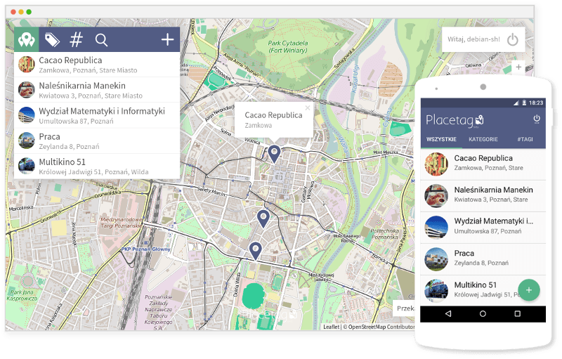

# Wstęp {-}

Sealious (wym. */si\:liəs/*) jest *deklaratym*, *modułowym* frameworkiem do tworzenia aplikacji webowych i desktopowych przy użyciu języka JavaScript w środowisku Node.js. 

Sealious służy do tworzenia "backendu" aplikacji---nie jest narzędziem do projektowania interfejsów graficznych. Udostępnia interfejs *programistyczny* przyjazny deweloperom odpowiedzialnym za "frontend" aplikacji. 

### Deklaratywność

"Deklaratywność" oznacza, że deweloper tworzący aplikację przy użyciu Sealiousa musi tylko opisać *co* ma owa aplikacja robić, a nie *jak*. Deklaratywny opis aplikacji sealiousowej^[dla zwięzłości będziemy używać sformułowania "aplikacja sealiousowa", mając na myśli "aplikacja napisana przy użyciu frameworka Sealious"] jest czytelny i jednoznaczny dla człowieka i dla maszyny.

Jak zobaczymy w następnych rozdziałach, deklaratywność Sealiousa umożliwia tworzenie w pełni funkcjonalnych aplikacji zawartych w bardzo małej ilości kodu.

### Modułowość

"Modułowość" oznacza, że aplikację sealiousową można łatwo rozszerzać za pomocą tzw. "pluginów". Pluginy sealiousowe są wielokrotnego użytku---co oznacza, że raz napisany plugin będzie się zachowywał prawidłowo w każdej aplikacji sealiousowej^[przykładem jest plugin "REST". Wystarczy doinstalować go do dowolnej aplikacji Sealiousowej, aby uzyskać w pełni funckjonalne REST API dla tej aplikacji - bez potrzeby żadnej dodatkowej konfiguracji.]. Pluginy mogą (ale nie muszą) zawierać imperatywny (*nie*deklaratywny) kod.

### Rozwój frameworka

Celem naszego projektu był rozwój Sealiousa. W trakcie prac nad nim:

* zidentyfikowaliśmy i naprawiliśmy 50 problemów z kodem (brakujące funkcjonalności, bugi, niespójności w dokumentacji)
* zwiększyliśmy objętość kodu o ok. 30%^[Może się wydawać, że 30% to nie jest dużo, ale jesteśmy dumni z faktu, że uzyskaliśmy tak duży postęp bez drastycznego zwiększania objętości kodu. Bardzo często okazywało się, że po naprawieniu buga albo dodaniu nowej funkcjonalności do Sealiousa kodu w repozytorium ubywało, ponieważ przepisaliśmy kod tak, aby rozwiązywał bardziej ogólny problem---który często bywa prostszy niż kilka konkretnych.]
* dokończyliśmy prace nad wersją `0.6` (została ona doprowadzona do stanu `stable`) oraz równolegle rozwijaliśmy nową wersję, `0.7` (aktualnie w stanie `alpha`), bogatą w nowe funkcje i rozwiązania. 

### Przykład wdrożenia

Przez ostatnie pół roku rozwój Sealiousa był mocno kierowany potrzebami projektu Placetag---również realizowanego jako projekt inżynierski na WMI UAM, pod opieką dr-a Jacka Marciniaka.

Placetag to serwis internetowy stworzony za pomocą Sealiousa, pozwalający na zapisywanie miejsc na mapie oraz na łatwe wysyłanie odnośników do nich za pomocą sieci społecznościowych.

Zapisane w nim miejsca można dzielić na kategorie, nadawać im "hashtagi" i wzbogacać ich opisy o zdjęcia (które po stronie serwera są skalowane i kompresowane w celu optymalizacji zużycia pasma).

Serwis ten posiada dwie aplikacje klienckie---interfejs webowy oraz aplikację na platformę Android. 

Dzięki zastosowaniu Sealiousa kod backendu tego serwisu ma małą objętość -  zawiera się w około 200 linijkach. 

Projekt Placetag zakończył się sukcesem - w Internecie jest już dostępna jego publiczna, "produkcyjna" wersja. 

